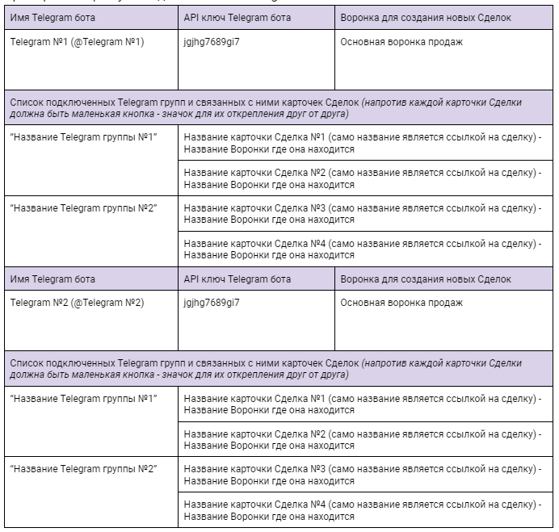

# Техническое задание для разработки публичной интеграции amoCRM (виджета) «Telegram бот для общения через amoCRM» от REON

# Основная задача: 
Виджет позволяет вести переписку (получать и отправлять сообщения) с клиентами в amoCRM через любого добавленного в виджет Telegram бота. Самая главная особенность виджета - это возможность не только переписываться персонально с пользователем, который подписан на бота в Telegram, но и вести общение сразу с группой пользователей в Telegram, добавленных вместе с ботом в общую “Telegram группу”. Все сообщения отправленные в “Telegram группу” попадают в amoCRM в конкретную карточку Сделки и фиксируются от разных пользователей, а из карточки Сделки есть возможность отправить сообщение в общую группу сразу всем пользователям. Кроме того, виджет позволяет добавить сразу двух и более Telegram ботов для переписки через несколько каналов коммуникации. 

# Назначение и принцип работы:
# Часть 1 - Персональные сообщения.
Бот должен фиксировать сообщения от клиентов, которые были отправлены персонально боту, данные сообщения долрсональные сообжны попадать в карточку Сделки, создавать Беседу и сохраняться в истории общения в amoCRM.

Если карточка Контакта в amoCRM найдена по Telegram ID, то бот фиксирует сообщения в уже имеющейся карточке Сделки, где есть (прикреплена) эта карточка Контакта (должно соблюдаться одно и трех правил выбранное в общих настройках amoCRM - см. Скриншот №1).

Если карточка Контакта в amoCRM по Telegram ID не найдена, то при входящем сообщение создается карточка Сделки и Контакта и в карточке Сделки создается новая Беседа.

У каждого подключенного к виджету Telegram бота должна быть возможность выбрать в какой из Воронок продаж создавать карточку Сделки при входящем сообщении (в виде выпадающего списка).

Для ответа клиенту через карточку Сделки должна быть возможность в стандартном функционале amoCRM выбрать раздел “Чат” и “Имя пользователя” с короткой припиской названия Telegram бота, через которого ты будешь отвечать. Данное имя с припиской должно появляться только когда клиент начала переписку с Telegram ботом.

Все сообщения должны отображаться в разделе “imBox” и должен быть доступен весь его функционал. Кроме того должен быть доступен функционал массовой отправки сообщений через раздел “Списки” и функционал настройки и отправки сообщений через SalesBot. 

Скриншот №1.

# Часть 2 - Общение через Telegram группу.

Бот должен фиксировать сообщения от клиентов, которые были отправлены в Telegram группе (куда бот был заранее добавлен), затем передавать их в карточку сделки, где идет работа по проекту или сопровождению конкретного клиента.

Предполагается настройка связки ID группы в Telegram -> ID Сделки в amoCRM. При этом одна группа в Telegram может быть связана сразу с несколькими сделками в amoCRM.

Предполагаемый алгоритм подключения связки между Telegram  ботом, Telegram группой и карточкой Сделки в amoCRM:
1. Создать группу в Telegram.
2. Добавить в неё аккаунт отдела продаж REON, Telegram бота добавленного в наш виджет и Telegram аккаунты клиентов.
3. Обратиться в группе к Telegram боту и в открывшемся меню нажать кнопку “Связать группу со Сделкой”. После нажатия на кнопку появляется запрос (поле) для ввода ID сделки. После ввода и отправки ID сделки - группа считается связанной с конкретной карточкой Сделки в amoCRM.

Необходимо сразу предусмотреть возможность отвязать конкретную сделку от группы в Telegram. Для этого в меню бота добавить еще одну кнопку “Список связанных Сделок”, при нажатии на которую должен быть показан пронумерованный список сделок в виде ссылок на них, чтобы можно было быстро перейти и посмотреть что это за карточка Сделки. Далее под каждой ссылкой на карточку Сделки должна быть кнопка “Отвязать”, при нажатии на которую карточка Сделки отвязывается от Telegram  группы. Отвязать карточки Сделок о Telegram бота должна быть возможность в том числе и через модальное окно дополнительных настроек виджета.

Сообщения, которые пишут пользователи в Telegram группе, бот фиксирует и передает во все связанные с Telegram группой карточки Сделок. При первом входящем сообщение создается Беседа с конкретной карточкой Контакта.

Если карточка Контакта в amoCRM найдена по Telegram ID и эта карточка привязана к, связанной с Telegram группой Сделкой, то бот фиксирует сообщение в этой Сделке.

Если карточка Контакта в amoCRM по Telegram ID не найдена (такого Контакта нет), то при входящем сообщение из Telegram группы создается карточка Контакта и привязывается ко всем сделкам связанным с этой Telegram группой, создается в каждой из сделок Беседа и фиксируется сообщение от конкретного Контакта.

Если карточка Контакта в amoCRM по Telegram ID найдена, но она не привязана к сделкам связанным Telegram группой, то эта карточка контакта должна автоматически привязаться ко всем сделкам связанным с этой Telegram группой.

Для ответа клиентам в Telegram группу через карточку Сделки должна быть возможность в стандартном функционале amoCRM выбрать раздел “Чат” и “Имя группы” с короткой припиской названия Telegram бота, через которого ты будешь отвечать. Данное имя группы с припиской должно появляться только когда Telegram группа была привязана к этой карточке Сделки.

**Тип виджета:** платный.

**Тестовый период виджета:** 14 дней.

**Дополнительно:** все окна, чек-боксы, поля, шрифт и весь остальной интерфейс настройки и работы с виджетом должен быть максимально похож или идентичен стандартному интерфейсу amoCRM.

**Области настройки и использования виджета:**  
- Окно настроек виджета в amoМаркет;
- Окно дополнительных настроек “«Telegram бот для общения через amoCRM» от REON” в разделе “Настройки”.

**Модальное окно главных настроек виджета:**

Окно настроек должно содержать стандартный шаблон REON и поля для ввода данных пользователя:
- Имя,
- Тефон.

По нажатию на кнопку “Сохранить”, должен отправляться запрос на widget_controller для регистрации клиента в аккаунте REON.PRO.ел

**Модальное окно дополнительных настроек виджета:**

Окно настроек должно содержать таблицу с уже подключенными Telegram ботами и кнопку для добавления новых Telegram ботов “Добавить Telegram бота”. В таблице должен быть реализован поиск по Telegram Боту и поиск по Telegram группе. Также в таблице должны быть кнопки для редактирования настроек Ботов, чтобы можно было поменять воронку, и кнопка для удаления Telegram бота с проверочным меню - “Точно удалить бота?“.

**Пример таблицы с уже подключенными Telegram ботами:**

**Пример меню для добавления новых Telegram  ботов:**

